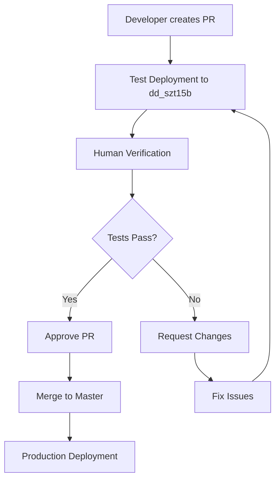

# 🧪 Testing Workflow for Production Deployments

This document describes the testing workflow that ensures all production application manifest changes are thoroughly tested before being deployed to production cluster groups.

## 📋 Workflow Overview



## 🔄 Process Steps

### 1. **Create Pull Request**
- Developer creates a PR with manifest changes
- PR template automatically provides testing checklist
- GitHub Actions workflow triggers automatically

### 2. **Automated Test Deployment**
- Changes are automatically deployed to `dd_szt15b` test cluster group
- Only changed manifest files are processed
- Compilation and deployment happen automatically

### 3. **Human Verification Required**
- **Reviewer must verify deployment in Fleet Manager UI**
- **Test deployed applications in `dd_szt15b` cluster group**
- **Confirm applications work as expected**

### 4. **Approval Process**
- ✅ **Approve PR**: If tests pass and deployment is successful
- ❌ **Request Changes**: If tests fail or issues are found

### 5. **Production Deployment**
- Once PR is merged to `master`, production deployment happens automatically
- Changes are deployed to all production cluster groups

## 🎯 Test Cluster Group

**Primary Test Environment:** `dd_szt15b`

This cluster group is dedicated to testing changes before they reach production. All PR deployments go here first.

### Fleet Manager Links:
- [Test Cluster Group: dd_szt15b](https://fleet.scalecomputing.com/cluster-groups?org=63b8337ec6939fdfb0f716af)
- [All Deployments](https://fleet.scalecomputing.com/deployments?org=63b8337ec6939fdfb0f716af)
- [Applications](https://fleet.scalecomputing.com/deployment-applications?org=63b8337ec6939fdfb0f716af)

## 🛠️ Deployment Scripts

### Test Deployment Scripts:
-   **`scripts/test-deploy.py`**: Creates separate test applications with `-test` suffix and deploys them to the test cluster group (`dd_szt15b`). This ensures production applications are never affected during testing.
    ```bash
    python3 scripts/test-deploy.py manifests/your-manifest.yaml
    ```

-   **`scripts/cleanup-test-apps.py`**: Cleans up test applications and deployments when testing is complete.
    ```bash
    # Dry run (see what would be deleted)
    python3 scripts/cleanup-test-apps.py
    
    # Actually delete test apps
    python3 scripts/cleanup-test-apps.py --execute
    ```

### Production Deployment Scripts:
-   **`scripts/production-deploy.py`**: Deploys original applications to production cluster groups, with safeguards to prevent accidental deployment of test applications.
    ```bash
    python3 scripts/production-deploy.py manifests/your-manifest.yaml
    ```

## 📝 PR Template Checklist

Each PR includes a checklist that reviewers must complete:

### Pre-Deployment Testing
- [ ] Changes have been tested locally (if applicable)
- [ ] YAML syntax is valid
- [ ] All required fields are present

### Test Deployment Verification
- [ ] **Test deployment to `dd_szt15b` completed successfully**
- [ ] **Verified deployment in Fleet Manager UI**
- [ ] **Tested deployed applications in `dd_szt15b` cluster group**
- [ ] **Confirmed applications are working as expected**

### Production Readiness
- [ ] All tests passed in test environment
- [ ] No breaking changes detected
- [ ] Documentation updated (if needed)

## 🔧 Environment Variables

The testing workflow uses these environment variables:

### Test Deployment
```bash
CLUSTER_GROUP_NAME=dd_szt15b
TEST_MODE=true
```

### Production Deployment
```bash
# No specific cluster group (deploys to all)
TEST_MODE=false
```

## 🚨 Important Rules

### ❌ **DO NOT MERGE UNTIL:**
- Test deployment is verified in Fleet Manager UI
- Applications are tested and working in `dd_szt15b`
- All checklist items are completed
- Human reviewer approves the PR

### ✅ **SAFE TO MERGE WHEN:**
- All tests pass in test environment
- No breaking changes detected
- Reviewer has verified deployment
- All checklist items are completed

## 🔍 Troubleshooting

### Test Deployment Failed
1. Check GitHub Actions logs for errors
2. Verify YAML syntax is correct
3. Ensure all required fields are present
4. Fix issues and push new commits

### Application Not Working in Test
1. Check Fleet Manager UI for deployment status
2. Verify application configuration
3. Test manually in `dd_szt15b` cluster group
4. Fix issues and create new PR

### Production Deployment Issues
1. Check production deployment logs
2. Use cleanup scripts if needed
3. Consider rollback if necessary

## 📊 Monitoring

### GitHub Actions
- Test deployments: `.github/workflows/test-deployment.yml`
- Production deployments: `.github/workflows/production-deployment.yml`

### Fleet Manager
- Monitor deployments in real-time
- Check application status
- Verify cluster group health

## 🛠️ Manual Testing Commands

If you need to test manually:

```bash
# Test deployment to dd_szt15b
export CLUSTER_GROUP_NAME=dd_szt15b
export TEST_MODE=true
python scripts/deploy.py

# Production deployment (be careful!)
export TEST_MODE=false
python scripts/deploy.py
```

## 📚 Related Documentation

- [README.md](README.md) - Main project documentation
- [DEPLOYMENT_SUMMARY.md](DEPLOYMENT_SUMMARY.md) - Deployment details
- [QUICKSTART.md](QUICKSTART.md) - Quick start guide
